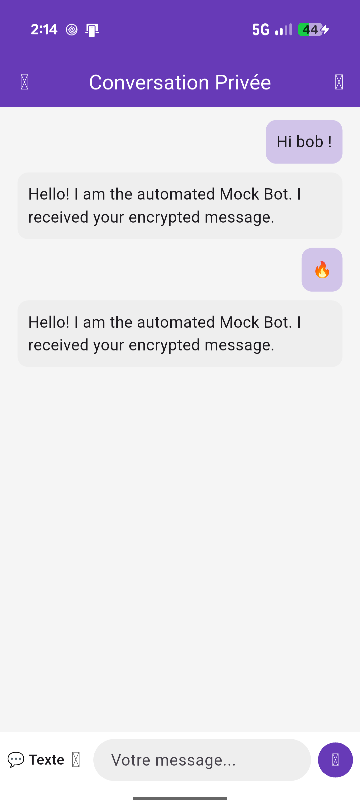

# Alto - Always Together



**Alto** is a clean, modern, and highly secure mobile messaging application built with Flutter. It focuses on privacy and simplicity, ensuring that your conversations remain yours and yours alone through robust end-to-end encryption.

## 🚀 Features

- **End-to-End Encryption:** Messages are encrypted locally on the device using asymmetric RSA encryption. The server only routes encrypted payloads.
- **Secure Pairing Process:** Users connect securely by scanning QR codes, establishing trust through a cryptographic key exchange mechanism.
- **Local Key Management:** Private keys are generated and stored securely on the local device and never leave it.
- **Real-Time Polling:** Continuous auto-refresh capability keeping the chat view up to date while maintaining the state cleanly using Flutter's native `setState`.
- **Robust Error Handling:** Designed to gracefully handle network dropouts and api timeouts with clear `SnackBar` feedback.

## 🛠 Tech Stack

- **Framework:** Flutter (Dart)
- **State Management:** Stateful Widgets (`setState`) 
- **Crypto:** PointyCastle, BasicUtils (RSA keys, OAEP Padding)
- **Scanning:** Mobile Scanner (QR Code reading & pairing)

## 📦 Architecture

- **`lib/crypto/`**: Core cryptographic primitives for generating RSA key pairs, storing private keys, and encrypting/decrypting messages.
- **`lib/services/`**: Abstracts network and data layers. Currently utilizes a robust **Mock Implementation** to allow recruiters or developers to test the full flow offline.
- **`lib/screens/`**: UI implementations of the pairing process, scanning, and the secure chat relation screen.

## 🔧 Getting Started

This repository is configured to be portfolio-ready and can be tested locally right away!

### Prerequisites

- Flutter SDK (latest stable version recommended)
- An Android / iOS Emulator or physical device

### Installation

1. Clone this repository:
   ```bash
   git clone https://github.com/your-username/alto.git
   ```
2. Fetch dependencies:
   ```bash
   flutter pub get
   ```
3. Run the app:
   ```bash
   flutter run
   ```

*Note: The original backend (`https://alto.samyn.ovh`) has been safely retired. The application now uses an embedded Mock API Client (`ApiClient`) that accurately simulates all network conditions, delays, and cryptographic handshakes so the application functions flawlessly offline for demonstration purposes.*
